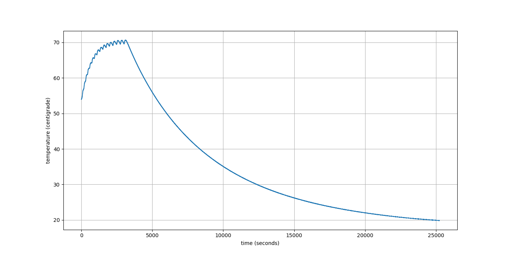
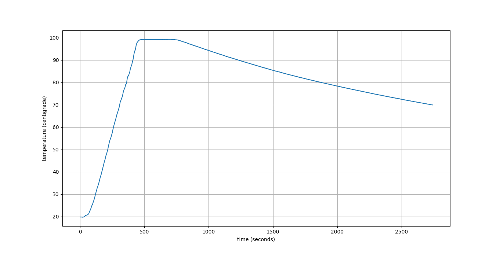

logtemp
=======

Simple temperature logger using an Arduino and a DS18B20 sensor.

## Steps to Use
1. Connect sensor to Arduino, Arduino to Computer.
2. Flash `logger.ino` to Arduino.
3. Log serial console output, e.g. with `picocom /dev/ttyACM0 | tee temperatures.log`
4. Plot the data with `./plot.py temperatures.log`

## Examples

